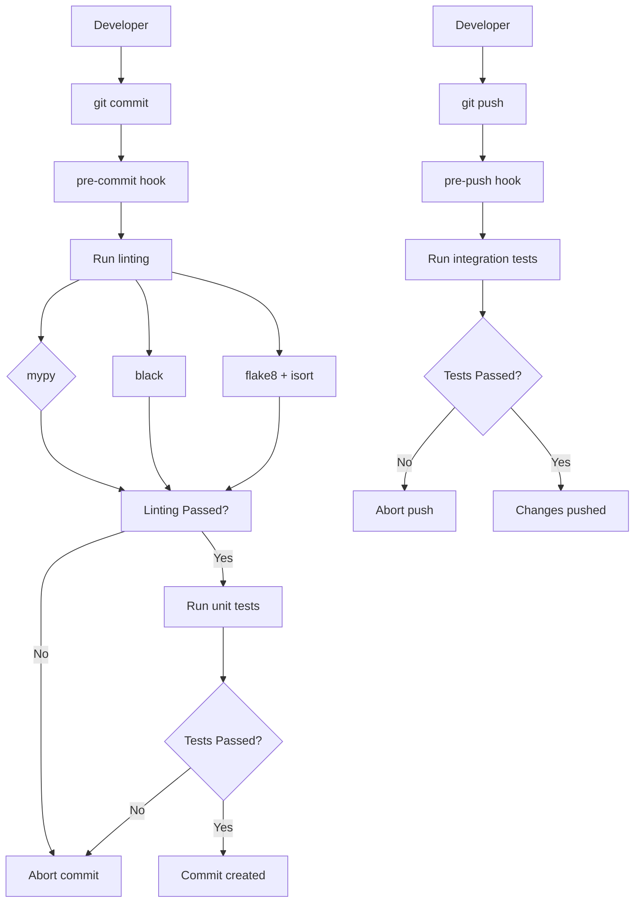
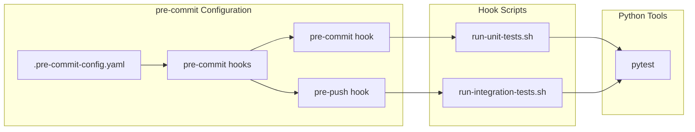
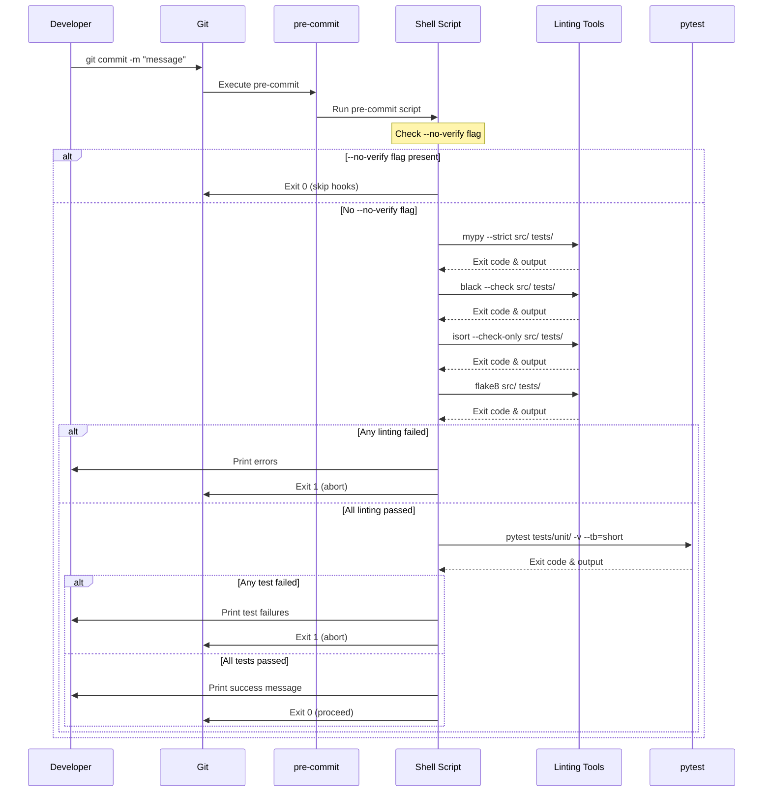
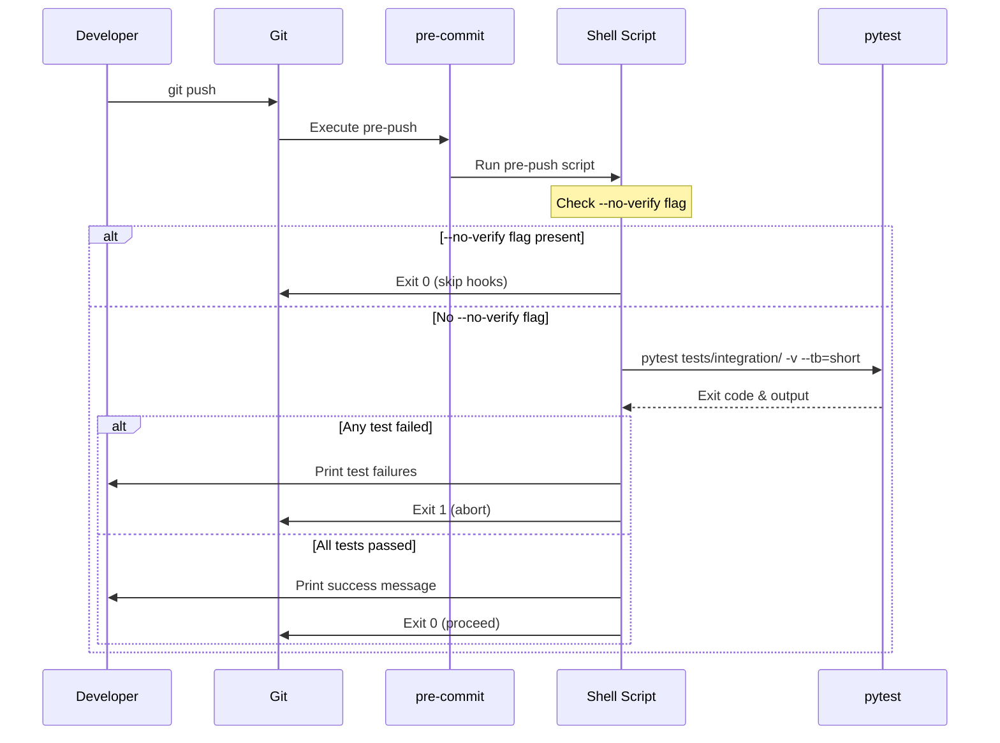

# pre-commit Git Hooks Integration Design Document

**Specification Version:** 1.0.0  
**Related Requirements:** [requirements.md](requirements.md)  
**Created:** 2025-12-30  
**Author:** Sisyphus AI Agent  
**Status:** Pivoted from Husky  
**Last Updated:** 2025-12-30

> **NOTE:** This specification was pivoted from Husky (Node.js-based) to pre-commit (Python-native) because this is a pure Python project. See Session Summary ses_48f1.md for details.

---

## 1. Executive Summary

### 1.1 Overview
This document describes the design for integrating pre-commit Git hooks into the scraping-service project. The implementation will automate code quality checks (linting with mypy, black, flake8, isort) and testing (unit and integration tests) before commits and pushes, ensuring code quality standards are maintained consistently across the codebase.

### 1.2 Key Design Decisions
| Decision | Choice | Rationale |
|----------|--------|-----------|
| Hook Manager | pre-commit | Python-native, standard for Python projects |
| Package Manager | pip | Native Python package manager |
| Hook Type | YAML configuration + shell scripts | pre-commit framework native |
| Linting Scope | Staged files only | Performance optimization per coding standards |
| Test Scope (pre-commit) | Unit tests only | Fast feedback, < 30s execution target |
| Test Scope (pre-push) | Integration tests only | Comprehensive validation before sharing |

### 1.3 Architecture Diagram


---

## 2. System Context

### 2.1 Scope
**In Scope:**
- Installation and configuration of pre-commit
- Pre-commit hook: linting (mypy, black, flake8, isort)
- Pre-commit hook: unit tests
- Pre-push hook: integration tests
- Documentation for developers
- Cross-platform support (macOS, Linux)

**Out of Scope:**
- CI/CD pipeline configuration
- Commit message validation
- Post-commit or post-merge hooks
- Windows support (may be added later)

### 2.2 Context Diagram
```
                    ┌─────────────────────────────────────────────────┐
                    │           Local Development Environment          │
                    │                                                  │
                    │  ┌──────────────┐     ┌──────────────────┐       │
    Developer ──────▶│  │   Git CLI    │────▶│  pre-commit      │       │
                     │  └──────────────┘     │  Framework       │       │
                     │                        │          │        │       │
                     │                        │          ▼        │       │
                     │  ┌──────────────────────────────────────────┐    │
                     │  │     Linting & Testing Pipeline            │    │
                     │  │  ┌────────┐ ┌────────┐ ┌────────┐        │    │
                     │  │  │ mypy   │ │ black  │ │ flake8 │        │    │
                     │  │  └────────┘ └────────┘ └────────┘        │    │
                     │  │  ┌────────┐ ┌────────┐                    │    │
                     │  │  │ isort  │ │ pytest │                    │    │
                     │  │  └────────┘ └────────┘                    │    │
                     │  └──────────────────────────────────────────┘    │
                     │                        │                        │
                     │                        ▼                        │
                     │  ┌──────────────────────────────────────────┐    │
                     │  │         Git Repository (.git/)           │    │
                     │  └──────────────────────────────────────────┘    │
                     └─────────────────────────────────────────────────┘
```

### 2.3 Stakeholders
| Role | Responsibility | Contact |
|------|----------------|---------|
| Tech Lead | Architecture decisions, code review | Team lead |
| Developers | Daily usage, providing feedback | All developers |
| QA Lead | Testing strategy validation | QA team |

---

## 3. Architecture

### 3.1 Architectural Style
- [x] Configuration-based automation
- [x] Git hooks (client-side)
- [x] YAML configuration + shell scripting
- [ ] Microservices
- [ ] Event-Driven Architecture
- [ ] RESTful API

### 3.2 Component Diagram


### 3.3 Component Description

#### 3.3.1 pre-commit Configuration
| Aspect | Description |
|--------|-------------|
| **Purpose** | Define and manage Git hooks via YAML configuration |
| **Responsibilities** | Configure hooks, manage hook execution order, install hooks |
| **Dependencies** | Python >= 3.11, pip |
| **Interface** | `pre-commit install`, `pre-commit run` |
| **Technology** | pre-commit framework, YAML |

#### 3.3.2 Pre-commit Hook
| Aspect | Description |
|--------|-------------|
| **Purpose** | Run linting and unit tests before commit |
| **Responsibilities** | Execute linting pipeline, run unit tests, report results |
| **Dependencies** | Shell scripts, Python tools |
| **Interface** | Executed by Git before `git commit` |
| **Technology** | pre-commit hook + bash script |

#### 3.3.3 Pre-push Hook
| Aspect | Description |
|--------|-------------|
| **Purpose** | Run integration tests before push |
| **Responsibilities** | Execute integration tests, report results |
| **Dependencies** | Shell scripts, Python tools |
| **Interface** | Executed by Git before `git push` |
| **Technology** | pre-commit hook + bash script |

---

## 4. Data Design

### 4.1 Configuration Files

#### 4.1.1 .pre-commit-config.yaml
```yaml
repos:
  - repo: https://github.com/pre-commit/mirrors-mypy
    rev: v1.14.0
    hooks:
      - id: mypy
        additional_dependencies: [pydantic>=2.5.0]
  - repo: https://github.com/psf/black
    rev: 25.1.0
    hooks:
      - id: black
        args: [--check, --diff]
  - repo: https://github.com/PyCQA/isort
    rev: 5.13.2
    hooks:
      - id: isort
        args: [--check-only, --diff]
  - repo: https://github.com/pycqa/flake8
    rev: 7.1.1
    hooks:
      - id: flake8

  - repo: local
    hooks:
      - id: unit-tests
        name: Run unit tests
        entry: bash scripts/run-unit-tests.sh
        language: system
        stages: [pre-commit]
        pass_filenames: false
```

#### 4.1.2 Shell Script Structure
All hook scripts follow this structure:

```bash
#!/bin/bash
# pre-commit hook script
# Purpose: [description]

set -euo pipefail

echo "[HOOK] Starting [hook name]..."

# Color codes for output
RED='\033[0;31m'
GREEN='\033[0;32m'
YELLOW='\033[1;33m'
NC='\033[0m' # No Color

# Helper functions
log_info() {
    echo -e "${GREEN}[INFO]${NC} $1"
}

log_warn() {
    echo -e "${YELLOW}[WARN]${NC} $1"
}

log_error() {
    echo -e "${RED}[ERROR]${NC} $1"
}

# Main execution
main() {
    log_info "Running [command]..."
    # Commands here
}

main "$@"
```

### 4.2 Hook Execution Flow

#### Pre-commit Hook Flow
```
1. Git triggers pre-commit hook
2. Script checks for --no-verify flag
3. Get list of staged Python files
4. Run linting tools (mypy, black, flake8, isort)
5. If any linting fails, print errors and exit 1
6. Run unit tests with pytest
7. If any test fails, print errors and exit 1
8. All checks passed, exit 0 (commit proceeds)
```

#### Pre-push Hook Flow
```
1. Git triggers pre-push hook
2. Script checks for --no-verify flag
3. Run integration tests with pytest
4. If any test fails, print errors and exit 1
5. All tests passed, exit 0 (push proceeds)
```

---

## 5. API Design

### 5.1 Not Applicable
This implementation does not expose an API. It consists of Git hooks that run as part of the Git workflow.

---

## 6. Security Design

### 6.1 Security Checklist
- [x] Hook scripts have restricted permissions (755)
- [x] No sensitive data logged or displayed
- [x] Exit codes properly handled to prevent bypass
- [x] Shell injection prevention via proper quoting

### 6.2 File Permissions
| File | Permission | Purpose |
|------|------------|---------|
| `.git/hooks/pre-commit` | 755 | Executable by Git (installed by pre-commit) |
| `.git/hooks/pre-push` | 755 | Executable by Git (installed by pre-commit) |
| `scripts/run-unit-tests.sh` | 755 | Unit test script |
| `scripts/run-integration-tests.sh` | 755 | Integration test script |

---

## 7. Sequence Diagrams

### 7.1 Pre-commit Hook Execution


### 7.2 Pre-push Hook Execution


---

## 8. Infrastructure Design

### 8.1 File Structure
```
scraping-service/
├── .pre-commit-config.yaml           # pre-commit configuration
├── scripts/
│   ├── run-unit-tests.sh             # Unit test script
│   └── run-integration-tests.sh      # Integration test script
├── pyproject.toml                    # Updated with pre-commit dependency
└── README.md                         # Will be updated
```

### 8.2 Installation Flow
```bash
# 1. Install pre-commit as dev dependency
pip install pre-commit

# 2. Create .pre-commit-config.yaml
# (already created in project)

# 3. Install Git hooks
pre-commit install
pre-commit install --hook-type pre-push

# 4. Run hooks on all files (first time setup)
pre-commit run --all-files
```

### 8.3 Developer Setup
```bash
# Clone repository
git clone https://github.com/tradingapp/scraping-service.git
cd scraping-service

# Create virtual environment
python -m venv venv
source venv/bin/activate

# Install dependencies
pip install -e ".[dev]"

# Install pre-commit hooks
pre-commit install
pre-commit install --hook-type pre-push
```

---

## 9. Testing Strategy

### 9.1 Hook Testing Approach
| Test Type | Approach | Tools |
|-----------|----------|-------|
| Manual verification | Execute hooks and verify behavior | Git, terminal |
| Linting verification | Verify linting tools run correctly | mypy, black, flake8, isort |
| Test execution | Verify pytest runs correctly | pytest |

### 9.2 Test Scenarios

#### 9.2.1 Pre-commit Hook Scenarios
| Scenario | Input | Expected Output |
|----------|-------|-----------------|
| Valid code staged | Clean Python files | Commit succeeds |
| Type error in code | File with mypy error | Commit blocked, error shown |
| Formatting error | File with black violation | Commit blocked, diff shown |
| Style error | File with flake8 violation | Commit blocked, error shown |
| Import order error | File with isort violation | Commit blocked, error shown |
| Test failure | Failing unit test | Commit blocked, test output shown |
| No Python files | Only docs/config changed | Commit succeeds |
| Skip hooks | `git commit --no-verify` | Commit succeeds |

#### 9.2.2 Pre-push Hook Scenarios
| Scenario | Input | Expected Output |
|----------|-------|-----------------|
| Passing integration tests | All integration tests pass | Push succeeds |
| Failing integration tests | Any integration test fails | Push blocked, error shown |
| Skip hooks | `git push --no-verify` | Push succeeds |

---

## 10. Performance Considerations

### 10.1 Performance Requirements
| Metric | Target | Measurement |
|--------|--------|-------------|
| Pre-commit hook total time | ≤ 30 seconds | Timer |
| Linting time (5 files) | ≤ 5 seconds | Timer |
| Unit tests time | ≤ 20 seconds | Timer |
| Pre-push hook total time | ≤ 5 minutes | Timer |

### 10.2 Optimization Strategies
| Area | Strategy | Expected Impact |
|------|----------|-----------------|
| Linting | Run only on staged files | 50% faster than full scan |
| Unit tests | Use pytest-xdist for parallel | 2-4x faster |
| Exit early | Fail fast on first error | Reduced wait time |

---

## 11. Error Handling Design

### 11.1 Error Categories
| Category | Handling | User Message |
|----------|----------|--------------|
| Linting failure | Exit 1, print errors | "Linting failed. Fix errors before committing." |
| Test failure | Exit 1, print failures | "Tests failed. Fix failures before committing." |
| Missing tool | Exit 1, helpful message | "Required tool not found. Install dependencies." |
| Script error | Exit 1, print trace | "Script error occurred. Check configuration." |

### 11.2 Error Output Format
```
[ERROR] Linting failed!

mypy findings:
src/module/file.py:10: error: "str" has no attribute "split_lines"
[ERROR] Commit aborted.
```

---

## 12. Migration & Rollback

### 12.1 Migration Strategy
| Phase | Action | Downtime |
|-------|--------|----------|
| Phase 1 | Create configuration files | Zero |
| Phase 2 | Install pre-commit and hooks | Zero |
| Phase 3 | Document setup process | Zero |

### 12.2 Rollback Plan
| Trigger | Action | Time |
|---------|--------|------|
| Hooks causing issues | `pre-commit uninstall` | < 1 minute |
| Disable specific hook | Remove hook from .pre-commit-config.yaml | < 1 minute |
| Full rollback | Revert commit with config | < 5 minutes |

---

## 13. Open Questions & Risks

### 13.1 Open Questions
| ID | Question | Impact | Owner |
|----|----------|--------|-------|
| Q-001 | Should isort be run before black? | Execution order | Tech Lead |
| Q-002 | Should we use `pytest-xdist` for parallel tests? | Performance | Team |
| Q-003 | Should we add commit message validation later? | Future scope | Team |

### 13.2 Identified Risks
| ID | Risk | Likelihood | Impact | Mitigation |
|----|------|------------|--------|------------|
| R-001 | Hooks slow down workflow | Low | Medium | Optimize, allow skip |
| R-002 | False positives from linters | Medium | Low | Fine-tune configs |
| R-003 | Developers bypass hooks | Low | High | Education, CI backup |

---

## 14. Revision History

| Version | Date | Author | Changes |
|---------|------|--------|---------|
| 1.1.0 | 2025-12-30 | Sisyphus | Pivoted from Husky to pre-commit. Updated architecture, components, and configuration. |
| 1.0.0 | 2025-12-30 | Sisyphus | Initial design document |

---

## Appendix A: Linting Configuration Reference

### mypy Configuration (pyproject.toml)
```toml
[tool.mypy]
python_version = "3.11"
warn_return_any = true
warn_unused_ignores = true
disallow_untyped_defs = true
```

### black Configuration (pyproject.toml)
```toml
[tool.black]
line-length = 88
target-version = ['py311']
```

### flake8 Configuration (pyproject.toml)
```toml
[tool.flake8]
max-line-length = 88
extend-ignore = E203
```

### isort Configuration (pyproject.toml)
```toml
[tool.isort]
profile = "black"
line_length = 88
```

---

## Appendix B: pytest Configuration Reference

### Unit Tests (pyproject.toml)
```toml
[tool.pytest.ini_options]
testpaths = ["tests/unit"]
python_files = ["test_*.py"]
python_functions = ["test_*"]
addopts = "-v --tb=short -m unit"
```

### Integration Tests (pyproject.toml)
```toml
[tool.pytest.ini_options]
testpaths = ["tests/integration"]
python_files = ["test_*.py"]
python_functions = ["test_*"]
addopts = "-v --tb=short -m integration"
```
